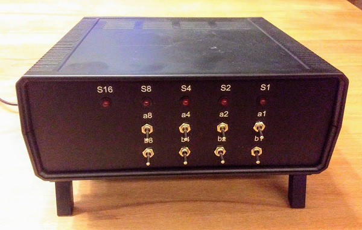
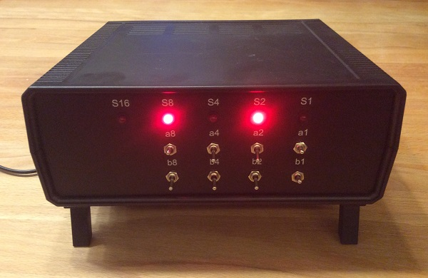
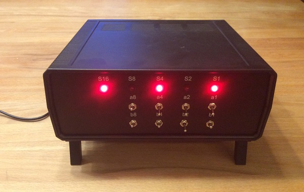
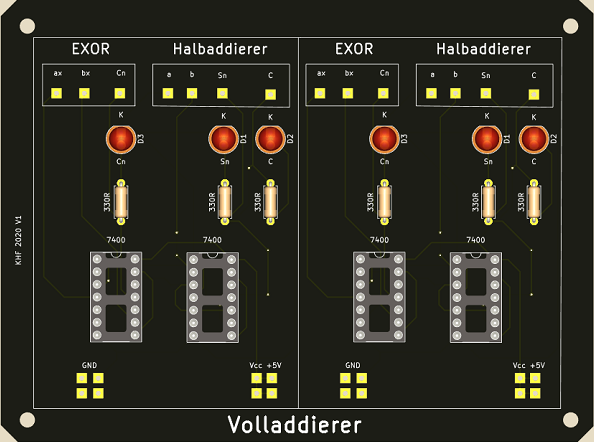
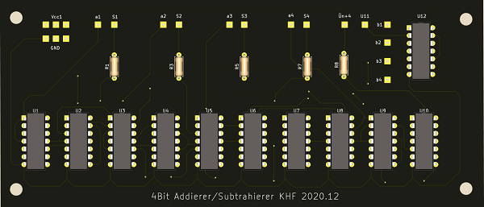
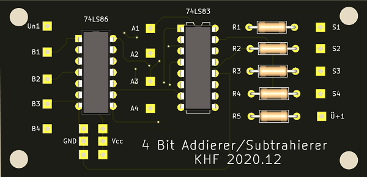

|[:skull:ISSUE](https://github.com/frankyhub/Halb-Volladdierer/issues?q=is%3Aissue)|[:speech_balloon: Forum /Discussion](https://github.com/frankyhub/Halb-Volladdierer/discussions)|[:grey_question:WiKi](https://github.com/frankyhub/Halb-Volladdierer/wiki)||
|--|--|--|--|
| | | | |
||<a href="https://github.com/frankyhub/Halb-Volladdierer/issues">|<a href="https://github.com/frankyhub/Halb-Volladdierer/discussions">|<a href="https://github.com/frankyhub/Halb-Volladdierer/releases">|
|| <a href="https://github.com/frankyhub/Halb-Volladdierer/pulse" alt="Activity">| <a href="https://github.com/frankyhub/Halb-Volladdierer/graphs/traffic">  |<a href="https://github.com/frankyhub?tab=stars"> |

# Halb-Volladdierer

2 Halbaddierer -> Volladdierer

4Bit Addierer/Subtrahierer

74LS83 4Bit 4Bit Addierer/Subtrahierer

---

   
<ol class="breadcrumb" style="border-top: 2px solid black;border-bottom:2px solid black; height: 45px; width: 900px;"> 
<a href="#oben">nach oben</a>
</ol>

  

---
